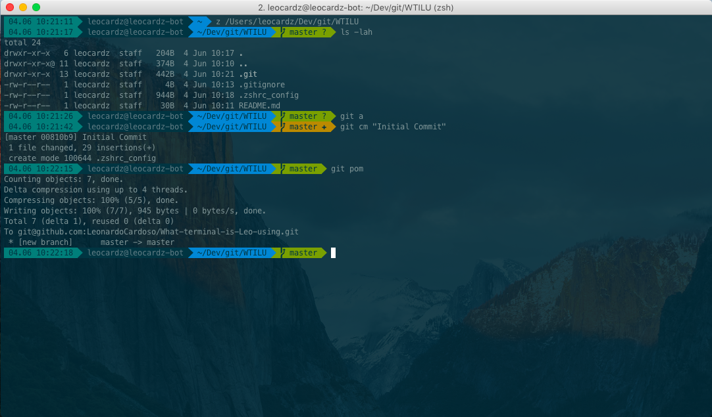

# What terminal is Leo using

Paraphrasing [Felix Krause's setup repo](https://github.com/KrauseFx/what-terminal-is-felix-using), here is some information about the setup I'm currently using.

* I use [iTerm2](https://www.iterm2.com/) instead of the stock terminal Mac app
* I use [oh-my-zshell](https://github.com/robbyrussell/oh-my-zsh)
* I use [Solarized Dark](http://ethanschoonover.com/solarized) for the terminal colors
* I use [powerline-shell](https://github.com/milkbikis/powerline-shell) to get those cool path bars.
* I use [powerlevel9k](https://github.com/bhilburn/powerlevel9k) theme to easily customise the shell. [This is my currently customisation](.zshrc_config)
* I use the [Meslo Powerline Font](https://github.com/powerline/fonts/blob/master/Meslo%20Slashed/Meslo%20LG%20M%20Regular%20for%20Powerline.ttf?raw=true) as you need a font that supports the directory characters for `powerline`
* I use [z](https://github.com/rupa/z) an amazing tool to quickly jump between projects. It learns which directories you visit most and autocomplete their path on the terminal
* I use [zsh-autosuggestions](https://github.com/zsh-users/zsh-autosuggestions) to improve even more the experience.
* I use a set of aliases for git and you can check them at [GitAliases](https://github.com/LeonardoCardoso/GitAliases/)
